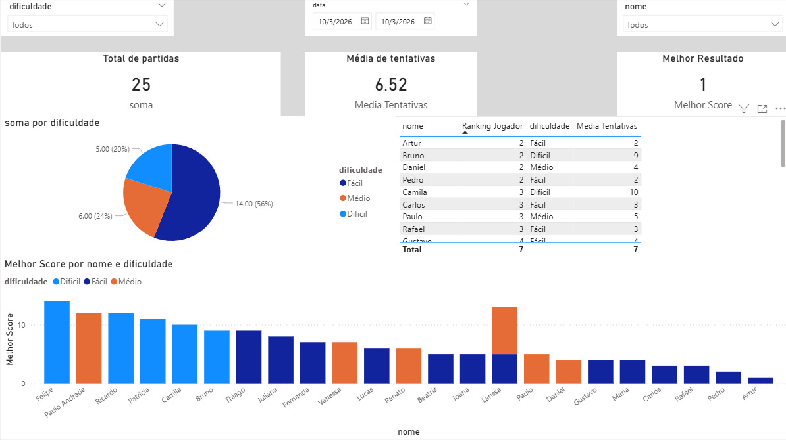

# 🎯 Jogo de Adivinhação com Análise de Dados


---

## 📌 Sobre o Projeto

Este projeto consiste no desenvolvimento de um **jogo de adivinhação em Python** com armazenamento de dados em **JSON** e análise dos resultados utilizando **Power BI**.

O sistema registra as partidas realizadas e permite explorar os dados por meio de um **dashboard analítico**, possibilitando visualizar métricas de desempenho dos jogadores.

O projeto foi desenvolvido com foco em aprendizado prático, envolvendo:

- lógica de programação
- manipulação de dados
- persistência em arquivos
- organização modular de código
- análise e visualização de dados

---

## 🚀 Funcionalidades

## 🎮 Sistema de Jogo

O jogador deve adivinhar um número gerado aleatoriamente pelo sistema.

Durante o jogo:

- o sistema gera um número aleatório
- o jogador realiza tentativas
- o sistema informa se o número correto é **maior ou menor**
- o jogo termina quando o número é acertado

### Exemplo

```text
Digite um número: 30
O número sorteado é maior

Digite um número: 70
O número sorteado é menor
```

## 🎚 Níveis de Dificuldade

O jogo possui três níveis de dificuldade:

| Dificuldade | Intervalo |
|-------------|-----------|
| Fácil       | 1 – 50    |
| Médio       | 1 – 100   |
| Difícil     | 1 – 500   |

## 💾 Registro de Partidas

Cada partida é armazenada em um arquivo **JSON** contendo:

- nome do jogador
- dificuldade
- número sorteado
- quantidade de tentativas
- data da partida

### Exemplo de registro

```json
{
  "nome": "Artur",
  "tentativas": 6,
  "numero_sorteado": 57,
  "dificuldade": "Médio",
  "data": "2026-03-10"
}
```

## 🏆 Ranking de Jogadores

O sistema gera um ranking dos jogadores com base no desempenho em cada nível de dificuldade.

**Critério utilizado:** menor número de tentativas.

O ranking é organizado **por dificuldade**, permitindo comparar os jogadores dentro de cada categoria do jogo.

### Exemplo

#### Fácil

```text
1 - Artur - 3 tentativas
2 - Maria - 4 tentativas
3 - João - 5 tentativas
```

#### Médio

```text
1 - Carlos - 4 tentativas
2 - Fernanda - 6 tentativas
3 - Rafael - 7 tentativas
```
### Difícil

```text
1 - Bruno - 9 tentativas
2 - Camila - 10 tentativas
3 - Patrícia - 11 tentativas
```
## 📊 Estatísticas do Sistema

Com base no histórico de partidas, o sistema calcula:

- total de partidas
- média de tentativas dos jogadores

Esses dados também são utilizados na análise com Power BI.

## 📈 Dashboard Power BI

Os dados gerados pelo jogo foram utilizados para construir um **dashboard analítico no Power BI**.

O dashboard permite visualizar:

- total de partidas
- média de tentativas
- melhor resultado
- ranking de jogadores
- distribuição de partidas por dificuldade
- desempenho dos jogadores

### Exemplo de Dashboard



## 🗂 Estrutura do Projeto

```text
jogo-adivinhacao-analise-dados/

main.py
jogo.py
ranking.py
historico.py
estatisticas.py
ranking.json
```

| Arquivo           | Responsabilidade             |
|-------------------|------------------------------|
| `main.py`         | ponto de entrada do sistema  |
| `jogo.py`         | lógica do jogo               |
| `historico.py`    | registro das partidas        |
| `ranking.py`      | geração do ranking           |
| `estatisticas.py` | cálculo de métricas          |

## 🧠 Conceitos de Programação Utilizados

Este projeto aplica diversos conceitos fundamentais de programação:

- estruturas condicionais (`if`, `else`)
- laços de repetição (`while`, `for`)
- funções
- manipulação de listas e dicionários
- leitura e escrita em JSON
- validação de entrada de usuário
- modularização de código

## 🛠 Tecnologias Utilizadas

- Python 3
- JSON
- Power BI
- Git
- GitHub

## 🎯 Objetivo do Projeto

Este projeto foi desenvolvido com objetivo educacional para praticar:

- programação em Python
- organização de projetos
- manipulação de dados
- análise de dados
- visualização com Power BI

## 👨‍💻 Autor

**Artur Diniz Lara Meira**

Interesses em:

- Python
- Análise de Dados
- Business Intelligence
- Inteligência Artificial
- Desenvolvimento de Sistemas
